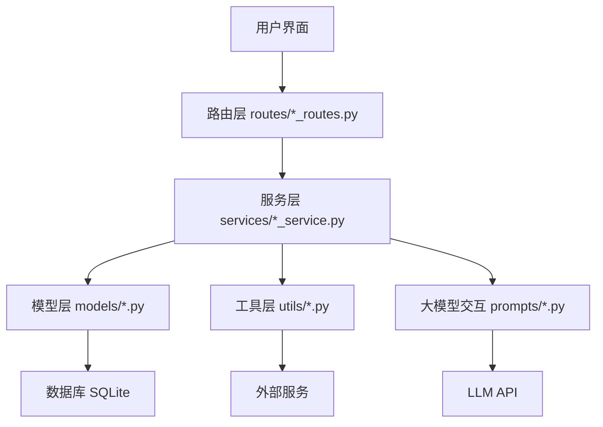
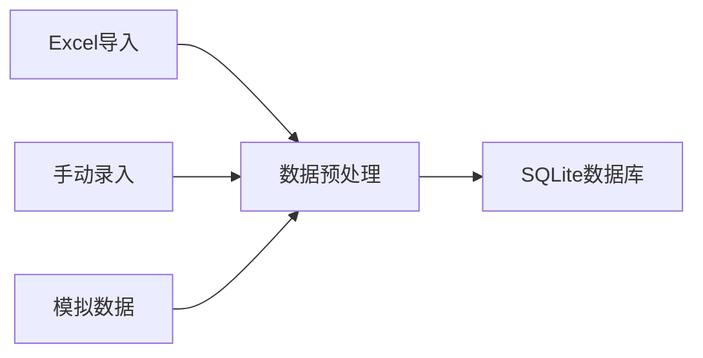
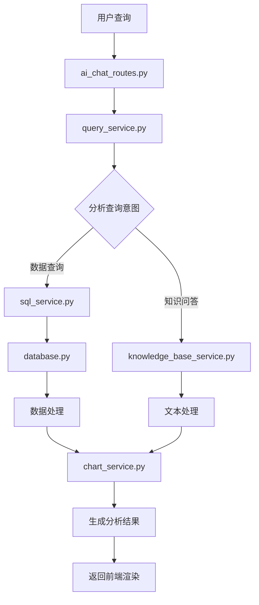
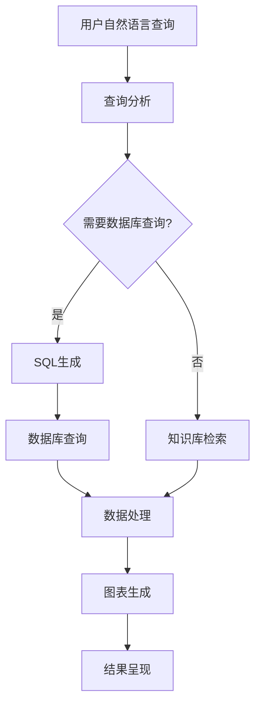
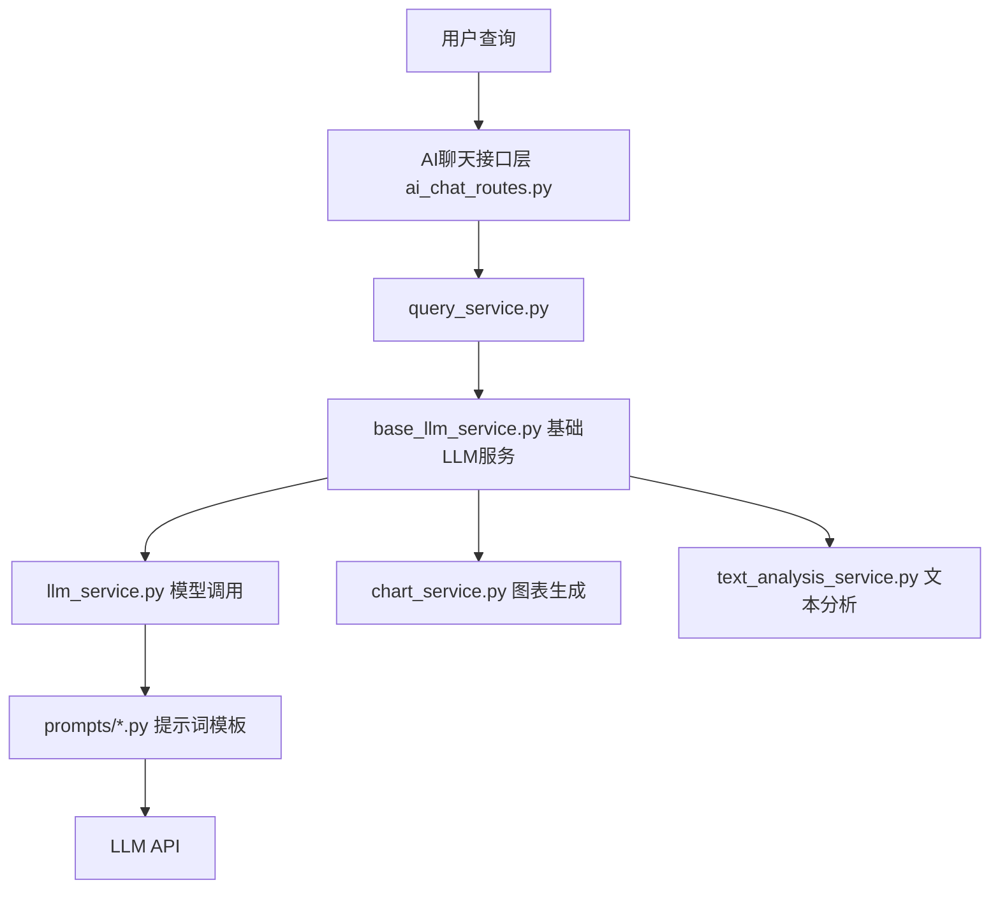

# MedicalMan - 智能医疗管理系统

<p align="center">
  
</p>

> MedicalMan是一个结合大语言模型技术的智能医疗管理系统，为医院管理者提供数据驱动的决策支持。

[](https://www.python.org/downloads/)
[](https://flask.palletsprojects.com/)
[](LICENSE)

## 📋 目录

- [系统概述](#系统概述)
- [核心功能](#核心功能)
- [AI智能助手](#ai智能助手)
- [报告导出功能](#报告导出功能)
- [技术架构](#技术架构)
- [项目结构](#项目结构)
- [系统组件与流程](#系统组件与流程)
- [数据流程](#数据流程)
- [大模型集成架构](#大模型集成架构)
- [优化策略与设计理念](#优化策略与设计理念)
- [未来规划](#未来规划)
- [安装与部署](#安装与部署)
- [使用指南](#使用指南)
- [开发指南](#开发指南)
- [常见问题](#常见问题)
- [团队与贡献](#团队与贡献)

## 🏥 系统概述

MedicalMan是专为医疗机构设计的新一代智能管理系统，结合大语言模型(LLM)技术，提供直观的数据可视化和智能分析能力。系统支持通过自然语言查询医疗数据，实现复杂医疗信息的高效管理和深度洞察。

### 应用场景

- **医院管理决策**：帮助管理层快速了解医院运营状况并做出数据驱动的决策
- **科室绩效评估**：全面评估各科室工作量、收入和目标完成情况
- **医生绩效管理**：跟踪和分析医生工作质量和效率指标
- **DRG管理优化**：深入分析DRG分组和成本控制情况
- **医疗数据分析**：通过自然语言与系统交互，获取深度数据分析

## 🔍 核心功能

### 智能分析仪表盘

- **全局概览**：实时展示医院关键绩效指标和运营状况
- **趋势分析**：通过动态图表展示各项指标的历史变化趋势
- **预警系统**：对异常指标进行智能预警和提示
- **导出报告**：一键导出专业仪表盘分析报告


### 多维度专题分析

- **科室分析**：科室运营数据多维度展示和比较
- **医生绩效**：医生工作量、质量和效率的量化评估
- **DRG分析**：DRG分组分析、绩效评价和费用控制
- **患者分析**：患者来源、构成和就诊路径分析
- **财务分析**：收入、支出、盈利能力的综合分析

### 智能报表系统

- **自定义报表**：根据需求定制个性化报表
- **定时推送**：设置报表自动生成和推送
- **多格式导出**：支持Excel、PDF等多种格式导出
- **聊天记录导出**：支持将AI分析对话导出为专业报告

### 智能问答报告导出

- **对话记录**：完整保留用户与AI的交互记录
- **智能摘要**：自动生成对话核心内容的摘要
- **关键发现**：突出显示对话中的重要医学发现
- **图表保留**：完整保留分析过程中生成的图表

### 报告模板系统

- **标准模板**：专业设计的通用报告模板
- **自定义模板**：支持医院根据需求定制模板
- **多种布局**：支持不同数据展示方式和页面布局
- **品牌定制**：可加入医院logo和品牌标识

### 导出格式与共享

- **多种格式**：支持PDF、HTML、Word等多种格式
- **加密保护**：可为敏感报告添加密码保护
- **批量导出**：支持多报告同时生成和导出
- **邮件分享**：支持通过邮件直接分享报告

## 🤖 AI智能助手

MedicalMan集成了基于大语言模型的AI智能助手，是系统的核心差异化功能。

### 自然语言数据查询

通过自然语言直接查询复杂医疗数据，无需编写SQL语句：

```
示例查询：
"请分析内科和外科近三个月的门诊量对比及变化趋势"
"计算2023年各季度DRG产出绩效最高的五个临床科室"
```

### 智能图表生成

- **自动可视化**：AI根据查询内容自动选择最合适的图表类型
- **交互式探索**：支持通过对话形式不断深入分析数据
- **多维度分析**：支持自动进行多维度、多角度的数据分析


### 报告解读与建议

- **专业解读**：对医疗数据和图表进行专业化解读
- **管理建议**：根据数据分析结果提供具体管理优化建议
- **问题诊断**：自动识别数据异常并提出可能的原因
- **对话导出**：支持将智能问答记录导出为专业PDF报告

### AI能力技术细节

- **模型**：基于深度求索大模型进行定制训练
- **知识库**：内置医疗专业知识库，支持本地知识检索
- **SQL生成**：将自然语言转换为精确的SQL查询
- **图表生成**：根据数据自动生成最适合的ECharts图表配置
- **错误处理**：具备强大的错误识别和修复能力

## 📊 报告导出功能

MedicalMan提供全面的报告导出功能，满足医疗管理不同场景的文档需求。

### 仪表盘报告导出

- **数据全面**：包含仪表盘上所有关键指标和图表
- **数据分析**：自动生成数据解读和分析结论
- **格式专业**：符合医疗行业报告规范的格式
- **灵活配置**：可选择要包含的指标和时间范围

### 智能问答报告导出

- **对话记录**：完整保留用户与AI的交互记录
- **智能摘要**：自动生成对话核心内容的摘要
- **关键发现**：突出显示对话中的重要医学发现
- **图表保留**：完整保留分析过程中生成的图表

### 报告模板系统

- **标准模板**：专业设计的通用报告模板
- **自定义模板**：支持医院根据需求定制模板
- **多种布局**：支持不同数据展示方式和页面布局
- **品牌定制**：可加入医院logo和品牌标识

### 导出格式与共享

- **多种格式**：支持PDF、HTML、Word等多种格式
- **加密保护**：可为敏感报告添加密码保护
- **批量导出**：支持多报告同时生成和导出
- **邮件分享**：支持通过邮件直接分享报告

## 💻 技术架构

### 前端技术

- **基础框架**：HTML5, CSS3, JavaScript ES6+
- **UI组件**：Bootstrap 5.0
- **图表库**：Chart.js, ECharts
- **交互增强**：jQuery, AJAX

### 后端技术

- **核心框架**：Python 3.8+, Flask 2.0+
- **数据处理**：Pandas, NumPy
- **AI引擎**：大语言模型API集成
- **安全框架**：Flask-Security, JWT认证
- **PDF生成**：WeasyPrint, Jinja2模板渲染

### 数据存储

- **主数据库**：SQLite 3（开发），MySQL/PostgreSQL（生产）
- **缓存系统**：Redis（可选）
- **文件存储**：本地文件系统，支持云存储扩展

### 部署方案

- **开发环境**：本地开发服务器
- **测试环境**：Docker容器化部署
- **生产环境**：Gunicorn/uWSGI + Nginx

## 📁 项目结构

```
medicalman/
├── static/
│   ├── css/                 # 样式文件
│   │   ├── utils/          # 工具类
│   │   │   ├── data-transformer.js  # 数据转换工具
│   │   │   └── chart-configs.js     # 图表配置模板
│   │   └── dashboard.js    # 仪表盘功能
│   └── img/                # 图片资源
├── templates/
│   ├── components/         # 组件目录
│   │   ├── layout/        # 布局组件
│   │   │   ├── header.html
│   │   │   ├── card.html
│   │   │   └── section_header.html
│   │   ├── widgets/       # 功能组件
│   │   │   └── stat_card.html
│   │   ├── charts/        # 图表组件
│   │   │   └── chart_container.html
│   │   ├── tables/        # 表格组件
│   │   │   └── data_table.html
│   │   ├── filters/       # 筛选组件
│   │   │   └── date_range.html
│   │   └── feedback/      # 反馈组件
│   │       ├── loading.html
│   │       └── error.html
│   ├── dashboard/         # 仪表盘页面
│   └── base.html          # 基础模板
├── app/
│   ├── __init__.py        # 应用初始化
│   ├── models/            # 数据模型
│   ├── views/             # 视图函数
│   └── utils/             # 工具函数
├── config.py              # 配置文件
└── requirements.txt       # 项目依赖
```

## 🔄 系统组件与流程

### 核心组件关系图



### 数据采集与预处理流程



### AI查询处理详细流程



### 系统内部调用关系

1. **应用初始化流程**
   - `run.py` 调用 `app/__init__.py` 中的 `create_app()` 函数
   - 应用工厂加载配置、初始化扩展、注册蓝图和错误处理器
   - 初始化数据库并启动应用服务器

2. **用户认证流程**
   - `auth_routes.py` 处理登录/注册请求
   - 调用 `auth_service.py` 验证凭据和管理会话
   - 使用 `security.py` 中的安全工具处理密码和令牌

3. **AI聊天交互流程**
   - `ai_chat_routes.py` 接收用户查询
   - 调用 `query_service.py` 处理查询
   - 根据查询类型调用 `sql_service.py` 或 `knowledge_base_service.py`
   - 结果通过 `chart_service.py` 生成可视化
   - 最终响应由 LLM 通过 `llm_service.py` 生成

4. **数据分析流程**
   - `analytics_routes.py` 处理分析请求
   - 调用 `data_analysis.py` 中的分析工具
   - 结果通过 `chart.py` 生成图表
   - 报告通过 `report_generator.py` 生成

## 🔄 数据流程

### 数据采集与预处理


### AI查询处理流程



## 🚀 安装与部署

### 环境要求

- Python 3.8+
- pip 20.0+
- 虚拟环境管理工具(venv, virtualenv)
- Git 2.0+

### 快速安装

```bash
# 克隆仓库
git clone https://github.com/yourusername/medicalman.git
cd medicalman

# 创建并激活虚拟环境
python -m venv .venv
source .venv/bin/activate  # Linux/macOS
# 或 .venv\Scripts\activate  # Windows

# 安装依赖
pip install -r requirements.txt

# 配置环境变量
cp .env.example .env
# 编辑.env文件，填写必要配置

# 初始化数据库
python scripts/init_db.py

# 导入测试数据
python scripts/import_data.py

# 启动应用
python run.py
```

访问 http://localhost:5101 开始使用系统。

### Docker部署

```bash
# 构建Docker镜像
docker build -t medicalman:latest .

# 运行容器
docker run -d -p 5101:5101 \
  -v ./instance:/app/instance \
  -v ./logs:/app/logs \
  --name medicalman \
  medicalman:latest
```

## 📖 使用指南

### 登录与权限

- **超级管理员**：`admin / Admin123!`（初始密码，请及时修改）
- **普通管理员**：`manager / Manager123!`
- **数据分析师**：`analyst / Analyst123!`

### AI智能助手使用方法

1. 导航至"AI聊天"界面
2. 输入自然语言查询，例如：
   - "分析最近一个月的门诊量趋势"
   - "比较内科和外科的绩效指标"
3. 查看AI返回的分析结果和自动生成的图表
4. 可通过点击"导出报告"按钮将对话内容导出为PDF报告

### 报告导出功能使用方法

#### 仪表盘报告导出
1. 在仪表盘页面配置所需的图表和数据视图
2. 点击页面上的"导出报告"按钮
3. 选择报告格式和内容选项
4. 点击确认后下载生成的PDF报告

#### 聊天记录报告导出
1. 在AI聊天界面完成分析对话
2. 点击界面上的"导出报告"按钮
3. 系统自动生成包含对话记录、分析摘要和图表的PDF报告
4. 报告将自动下载到本地

### 数据导入指南

系统支持多种数据导入方式：

1. **Excel导入**
   - 格式要求：遵循`docs/数据导入模板.xlsx`中的格式
   - 导入路径：管理后台 → 数据管理 → 导入数据

2. **手动录入**
   - 适用于少量数据
   - 操作路径：各模块管理页面 → 添加记录

3. **API导入**
   - 系统提供REST API接口用于数据集成
   - API文档：`/api/docs`

## 🔧 开发指南

### 代码规范

项目遵循PEP 8编码规范，并使用以下工具确保代码质量：
- flake8: 代码风格检查
- mypy: 类型检查
- black: 代码格式化

### 扩展AI功能

如需扩展AI分析能力，可修改以下文件：

1. `app/prompts/` - 添加或修改提示词模板
2. `app/services/llm_service.py` - 扩展LLM服务功能
3. `app/utils/json_helper.py` - 优化JSON处理和错误修复

### 添加新图表类型

1. 在`app/utils/chart.py`中添加新图表类型的生成逻辑
2. 更新`app/services/llm_service.py`中的`_generate_chart_prompt`方法
3. 在前端模板中添加对应的渲染支持

## ❓ 常见问题

### 数据相关

**Q: 如何备份系统数据？**  
A: 系统提供两种备份方式：
   1. 手动备份：管理后台 → 系统管理 → 数据备份
   2. 自动备份：配置`config/backup.py`中的自动备份周期

**Q: 系统支持哪些医疗数据格式？**  
A: 系统当前支持Excel格式的结构化数据导入，并计划添加对HL7, FHIR等医疗标准格式的支持。

### AI功能相关

**Q: 智能助手无法正确理解我的问题怎么办？**  
A: 尝试以下方法：
   1. 使用更具体和清晰的描述
   2. 明确指定时间范围、科室名称等关键信息
   3. 查看系统日志获取错误提示并调整问题

**Q: 图表生成失败怎么办？**  
A: 常见原因及解决方案：
   1. 数据不足：确保查询结果中有足够的数据点
   2. 格式错误：检查日志中的JSON解析错误信息
   3. 模型理解问题：尝试使用更简单明确的图表需求描述

## 👥 团队与贡献

### 核心团队

- 产品负责人: @product-lead
- 技术负责人: @tech-lead
- AI研发: @ai-developer
- 前端开发: @frontend-dev
- 后端开发: @backend-dev

### 贡献指南

欢迎提交Issue和Pull Request！贡献流程：

1. Fork项目
2. 创建特性分支 (`git checkout -b feature/amazing-feature`)
3. 提交更改 (`git commit -m 'Add amazing feature'`)
4. 推送分支 (`git push origin feature/amazing-feature`)
5. 创建Pull Request

---

## 📄 许可证

本项目采用MIT许可证 - 详见[LICENSE](LICENSE)文件

---

<p align="center">Copyright © 2023 MedicalMan Team</p>

## 💡 大模型集成架构

MedicalMan系统采用了模块化的大模型集成架构，通过多层封装确保系统稳定性和可扩展性。

### 大模型服务层次结构



### AI聊天思考过程

MedicalMan的AI聊天系统采用多阶段思考流程，确保分析的专业性和准确性：

1. **查询意图理解阶段**
   - 分析用户自然语言输入
   - 识别查询类型（数据分析、知识问答、图表生成等）
   - 提取关键实体（时间范围、科室、指标等）
   - 使用`app/prompts/querying.py`中的模板进行意图识别

2. **数据获取与转换阶段**
   - 对于数据分析类查询，生成优化的SQL语句
   - 执行数据库查询获取原始数据
   - 数据清洗与预处理，确保分析可靠性
   - 使用`app/utils/database.py`执行查询，`app/utils/data_processor.py`处理数据

3. **深度分析与洞察阶段**
   - 对数据进行统计分析和模式识别
   - 发现数据中的趋势、异常和相关性
   - 生成专业的医学解读和洞察
   - 使用`app/prompts/analyzing.py`中的专业医疗分析提示词

4. **可视化选择与生成阶段**
   - 根据数据特性和分析需求选择最合适的图表类型
   - 生成ECharts图表配置，优化视觉呈现
   - 确保图表专业性和可读性
   - 使用`app/prompts/visualization.py`中的图表生成提示词

5. **专业响应生成阶段**
   - 整合分析结果、图表和专业解读
   - 按照医疗报告规范格式化响应内容
   - 提供具有临床价值的建议和决策支持
   - 使用`app/prompts/responding.py`中的专业响应提示词

### 提示词系统架构

MedicalMan采用高度模块化的提示词系统，确保AI分析的专业性和一致性：

```
app/prompts/
├── __init__.py          # 提示词系统入口
├── analyzing.py         # 医疗数据分析提示词
├── parsing.py           # 数据解析提示词
├── querying.py          # 查询处理提示词
├── responding.py        # 响应生成提示词
├── visualization.py     # 图表生成提示词
└── templates/           # 特定场景模板
```

提示词设计遵循以下原则：
- **医学专业性**：嵌入医疗领域知识和术语
- **任务明确性**：每类提示词专注于特定功能
- **上下文管理**：维护对话历史和分析连续性
- **输出结构化**：规范JSON输出结构，便于前端渲染
- **安全可控**：防范提示词注入和不当输出

### 技术亮点

1. **模块化提示词管理**
   - 提示词模板分类存储在`app/prompts/`目录
   - 支持不同场景的专业提示词设计
   - 便于迭代优化和A/B测试

2. **多模型适配器**
   - 通过`base_llm_service.py`提供统一接口
   - 支持多种大模型API接入
   - 可根据任务特点选择不同模型

3. **错误处理与修复机制**
   - JSON响应自动修复
   - SQL生成纠错
   - 会话上下文管理

4. **知识增强架构**
   - 向量数据库集成
   - 医疗专业知识库
   - 本地知识检索系统

## 🔁 优化策略与设计理念

MedicalMan系统的设计遵循以下核心理念和优化策略：

### 系统设计原则

1. **模块化设计**
   - 高内聚低耦合的组件架构
   - 清晰的责任分离
   - 便于功能扩展和维护

2. **数据驱动设计**
   - 以医疗数据分析为核心
   - 提供多维度数据解读
   - 支持数据可视化决策支持

3. **用户体验优先**
   - 直观的界面设计
   - 自然语言交互
   - 专业报告自动生成

### 性能优化策略

1. **查询优化**
   - 数据库索引优化
   - SQL查询缓存
   - 大数据集分页处理

2. **模型调用优化**
   - 结果缓存机制
   - 批量处理请求
   - 异步非阻塞调用

3. **资源使用优化**
   - 延迟加载机制
   - 定时清理临时文件
   - 内存使用监控

### 安全设计策略

1. **数据安全**
   - 敏感数据加密存储
   - 访问权限精细控制
   - 操作日志完整记录

2. **API安全**
   - JWT认证
   - 请求限流保护
   - CSRF防护

3. **模型安全**
   - 提示词安全设计
   - 输出内容过滤
   - 异常响应处理

## 🚀 未来规划

MedicalMan系统计划在以下方向持续优化和扩展：

1. **功能扩展**
   - 引入更多医疗专业模型
   - 支持更复杂的医疗数据分析
   - 增加医疗影像分析能力

2. **技术升级**
   - 升级向量数据库架构
   - 引入更先进的大语言模型
   - 优化图表生成算法

3. **集成拓展**
   - 对接医院HIS系统
   - 支持更多医疗数据标准
   - 提供移动端应用

## 💻 技术架构
