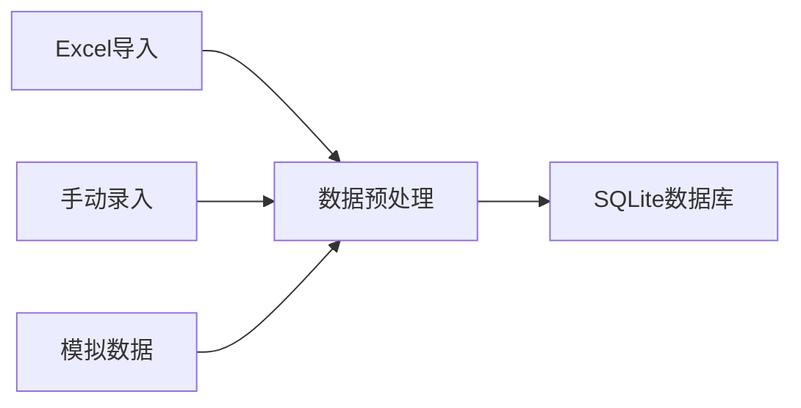
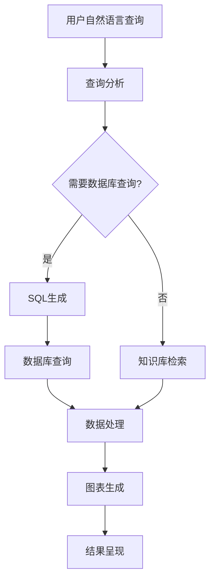

# MedicalMan - 智能医疗管理系统

<p align="center">
  
</p>

> MedicalMan是一个结合大语言模型技术的智能医疗管理系统，为医院管理者提供数据驱动的决策支持。

[](https://www.python.org/downloads/)
[](https://flask.palletsprojects.com/)
[](LICENSE)

## 📋 目录

- [系统概述](#系统概述)
- [核心功能](#核心功能)
- [AI智能助手](#ai智能助手)
- [技术架构](#技术架构)
- [项目结构](#项目结构)
- [数据流程](#数据流程)
- [安装与部署](#安装与部署)
- [使用指南](#使用指南)
- [开发指南](#开发指南)
- [常见问题](#常见问题)
- [团队与贡献](#团队与贡献)

## 🏥 系统概述

MedicalMan是专为医疗机构设计的新一代智能管理系统，结合大语言模型(LLM)技术，提供直观的数据可视化和智能分析能力。系统支持通过自然语言查询医疗数据，实现复杂医疗信息的高效管理和深度洞察。

### 应用场景

- **医院管理决策**：帮助管理层快速了解医院运营状况并做出数据驱动的决策
- **科室绩效评估**：全面评估各科室工作量、收入和目标完成情况
- **医生绩效管理**：跟踪和分析医生工作质量和效率指标
- **DRG管理优化**：深入分析DRG分组和成本控制情况
- **医疗数据分析**：通过自然语言与系统交互，获取深度数据分析

## 🔍 核心功能

### 智能分析仪表盘

- **全局概览**：实时展示医院关键绩效指标和运营状况
- **趋势分析**：通过动态图表展示各项指标的历史变化趋势
- **预警系统**：对异常指标进行智能预警和提示


### 多维度专题分析

- **科室分析**：科室运营数据多维度展示和比较
- **医生绩效**：医生工作量、质量和效率的量化评估
- **DRG分析**：DRG分组分析、绩效评价和费用控制
- **患者分析**：患者来源、构成和就诊路径分析
- **财务分析**：收入、支出、盈利能力的综合分析

### 智能报表系统

- **自定义报表**：根据需求定制个性化报表
- **定时推送**：设置报表自动生成和推送
- **多格式导出**：支持Excel、PDF等多种格式导出

## 🤖 AI智能助手

MedicalMan集成了基于大语言模型的AI智能助手，是系统的核心差异化功能。

### 自然语言数据查询

通过自然语言直接查询复杂医疗数据，无需编写SQL语句：

```
示例查询：
"请分析内科和外科近三个月的门诊量对比及变化趋势"
"计算2023年各季度DRG产出绩效最高的五个临床科室"
```

### 智能图表生成

- **自动可视化**：AI根据查询内容自动选择最合适的图表类型
- **交互式探索**：支持通过对话形式不断深入分析数据
- **多维度分析**：支持自动进行多维度、多角度的数据分析


### 报告解读与建议

- **专业解读**：对医疗数据和图表进行专业化解读
- **管理建议**：根据数据分析结果提供具体管理优化建议
- **问题诊断**：自动识别数据异常并提出可能的原因

### AI能力技术细节

- **模型**：基于深度求索大模型进行定制训练
- **知识库**：内置医疗专业知识库，支持本地知识检索
- **SQL生成**：将自然语言转换为精确的SQL查询
- **图表生成**：根据数据自动生成最适合的ECharts图表配置
- **错误处理**：具备强大的错误识别和修复能力

## 💻 技术架构

### 前端技术

- **基础框架**：HTML5, CSS3, JavaScript ES6+
- **UI组件**：Bootstrap 5.0
- **图表库**：Chart.js, ECharts
- **交互增强**：jQuery, AJAX

### 后端技术

- **核心框架**：Python 3.8+, Flask 2.0+
- **数据处理**：Pandas, NumPy
- **AI引擎**：大语言模型API集成
- **安全框架**：Flask-Security, JWT认证

### 数据存储

- **主数据库**：SQLite 3（开发），MySQL/PostgreSQL（生产）
- **缓存系统**：Redis（可选）
- **文件存储**：本地文件系统，支持云存储扩展

### 部署方案

- **开发环境**：本地开发服务器
- **测试环境**：Docker容器化部署
- **生产环境**：Gunicorn/uWSGI + Nginx

## 📁 项目结构

```
medicalman/
├── app/                      # 应用核心代码
│   ├── models/               # 数据模型和数据库交互
│   │   ├── llm_service.py    # 大语言模型服务
│   │   └── chart_service.py  # 图表生成服务
│   ├── controllers/          # 请求处理和路由控制
│   ├── presenters/           # 数据展示格式化
│   ├── utils/                # 工具函数和辅助方法
│   │   ├── json_helper.py    # JSON处理工具
│   │   └── chart.py          # 图表配置工具
│   ├── config/               # 配置管理
│   └── prompts/              # AI大模型提示词模板
│       ├── analyzing.py      # 数据分析提示词
│       └── medical_qa.py     # 医疗问答提示词
├── docs/                     # 项目文档和参考数据
├── instance/                 # 实例特定文件
├── static/                   # 静态资源
├── templates/                # HTML模板
├── tests/                    # 测试代码
├── migrations/               # 数据库迁移脚本
├── scripts/                  # 实用脚本
├── flask_session/           # Flask会话文件存储
├── .env                      # 环境变量配置
├── requirements.txt          # 项目依赖
├── run.py                    # 应用启动入口
└── README.md                 # 项目说明文档
```

## 🔄 数据流程

### 数据采集与预处理



### AI查询处理流程



## 🚀 安装与部署

### 环境要求

- Python 3.8+
- pip 20.0+
- 虚拟环境管理工具(venv, virtualenv)
- Git 2.0+

### 快速安装

```bash
# 克隆仓库
git clone https://github.com/yourusername/medicalman.git
cd medicalman

# 创建并激活虚拟环境
python -m venv .venv
source .venv/bin/activate  # Linux/macOS
# 或 .venv\Scripts\activate  # Windows

# 安装依赖
pip install -r requirements.txt

# 配置环境变量
cp .env.example .env
# 编辑.env文件，填写必要配置

# 初始化数据库
python scripts/init_db.py

# 导入测试数据
python scripts/import_data.py

# 启动应用
python run.py
```

访问 http://localhost:5101 开始使用系统。

### Docker部署

```bash
# 构建Docker镜像
docker build -t medicalman:latest .

# 运行容器
docker run -d -p 5101:5101 \
  -v ./instance:/app/instance \
  -v ./logs:/app/logs \
  --name medicalman \
  medicalman:latest
```

## 📖 使用指南

### 登录与权限

- **超级管理员**：`admin / Admin123!`（初始密码，请及时修改）
- **普通管理员**：`manager / Manager123!`
- **数据分析师**：`analyst / Analyst123!`

### AI智能助手使用方法

1. 导航至"AI聊天"界面
2. 输入自然语言查询，例如：
   - "2023年第一季度门诊量最高的三个科室是哪些？"
   - "比较内科和外科的门诊量近半年变化趋势"
   - "分析2023年DRG产出绩效与医生数量的关系"
3. AI助手将自动分析问题并返回数据分析结果和图表
4. 可以继续提问深入探讨，系统会保持上下文理解

### 数据导入指南

系统支持多种数据导入方式：

1. **Excel导入**
   - 格式要求：遵循`docs/数据导入模板.xlsx`中的格式
   - 导入路径：管理后台 → 数据管理 → 导入数据

2. **手动录入**
   - 适用于少量数据
   - 操作路径：各模块管理页面 → 添加记录

3. **API导入**
   - 系统提供REST API接口用于数据集成
   - API文档：`/api/docs`

## 🔧 开发指南

### 代码规范

项目遵循PEP 8编码规范，并使用以下工具确保代码质量：
- flake8: 代码风格检查
- mypy: 类型检查
- black: 代码格式化

### 扩展AI功能

如需扩展AI分析能力，可修改以下文件：

1. `app/prompts/` - 添加或修改提示词模板
2. `app/services/llm_service.py` - 扩展LLM服务功能
3. `app/utils/json_helper.py` - 优化JSON处理和错误修复

### 添加新图表类型

1. 在`app/utils/chart.py`中添加新图表类型的生成逻辑
2. 更新`app/services/llm_service.py`中的`_generate_chart_prompt`方法
3. 在前端模板中添加对应的渲染支持

## ❓ 常见问题

### 数据相关

**Q: 如何备份系统数据？**  
A: 系统提供两种备份方式：
   1. 手动备份：管理后台 → 系统管理 → 数据备份
   2. 自动备份：配置`config/backup.py`中的自动备份周期

**Q: 系统支持哪些医疗数据格式？**  
A: 系统当前支持Excel格式的结构化数据导入，并计划添加对HL7, FHIR等医疗标准格式的支持。

### AI功能相关

**Q: 智能助手无法正确理解我的问题怎么办？**  
A: 尝试以下方法：
   1. 使用更具体和清晰的描述
   2. 明确指定时间范围、科室名称等关键信息
   3. 查看系统日志获取错误提示并调整问题

**Q: 图表生成失败怎么办？**  
A: 常见原因及解决方案：
   1. 数据不足：确保查询结果中有足够的数据点
   2. 格式错误：检查日志中的JSON解析错误信息
   3. 模型理解问题：尝试使用更简单明确的图表需求描述

## 👥 团队与贡献

### 核心团队

- 产品负责人: @product-lead
- 技术负责人: @tech-lead
- AI研发: @ai-developer
- 前端开发: @frontend-dev
- 后端开发: @backend-dev

### 贡献指南

欢迎提交Issue和Pull Request！贡献流程：

1. Fork项目
2. 创建特性分支 (`git checkout -b feature/amazing-feature`)
3. 提交更改 (`git commit -m 'Add amazing feature'`)
4. 推送分支 (`git push origin feature/amazing-feature`)
5. 创建Pull Request

---

## 📄 许可证

本项目采用MIT许可证 - 详见[LICENSE](LICENSE)文件

---

<p align="center">Copyright © 2023 MedicalMan Team</p>
